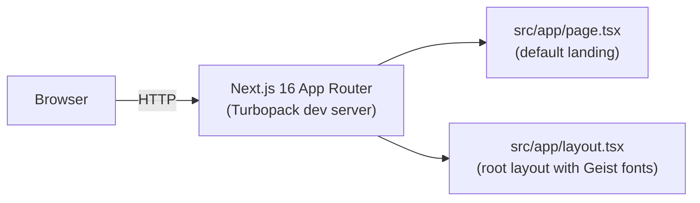
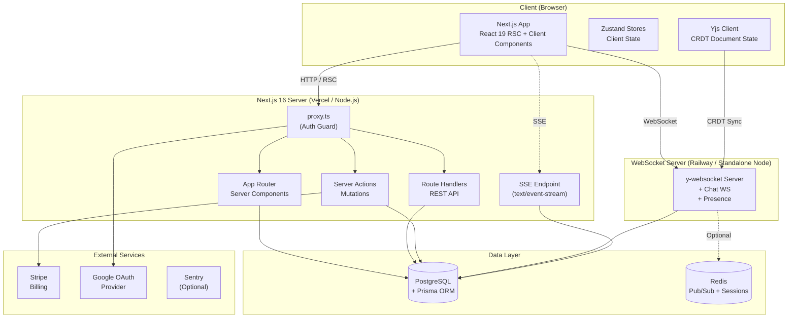
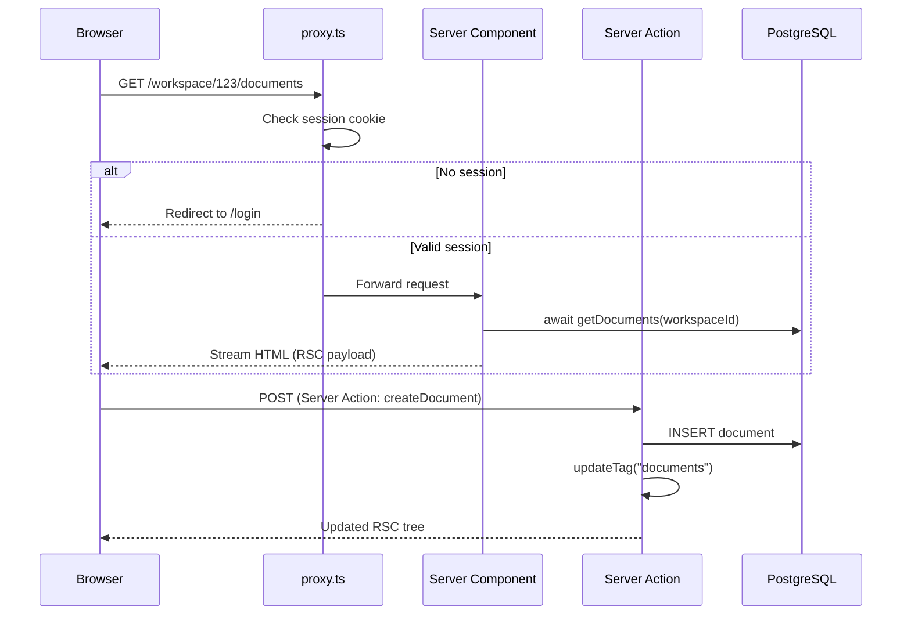
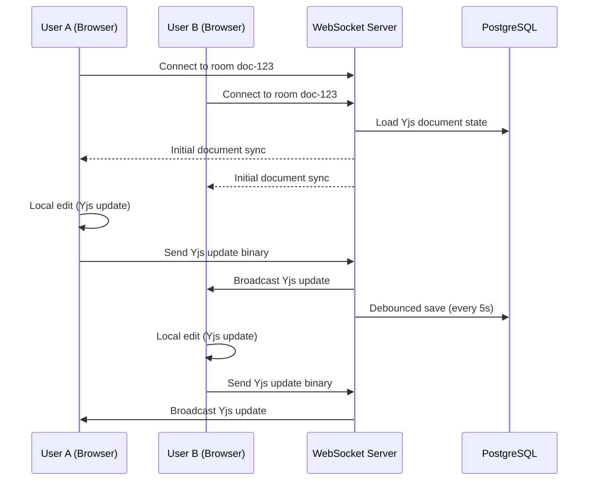

# Collaborative SaaS Workspace — Production-Grade Architecture Review

> **Document Type:** Architecture Review & Technical Design Document
> **Reviewer Posture:** Principal Software Architect / Staff Engineer / Tech Lead
> **Repository:** [`CRDT-next-POC`](file:///home/krutarth.pipaliya@simform.dom/Desktop/POCs/CRDT-next-POC)
> **Next.js Version:** 16.3.1 (App Router) with React 19.2.8

---

## 1. Executive Summary

The repository is a freshly scaffolded Next.js 16.3.1 project with **zero application code** — only the `create-next-app` boilerplate remains. The tooling foundation (Prettier, ESLint, Husky, lint-staged, Git Flow skill, PR template) is well-configured and production-quality. However, the codebase contains no domain logic, no database, no auth, no tests, and no infrastructure — it is a blank canvas.

The POC specification describes an **enterprise-grade SaaS workspace** spanning 24 functional requirements across authentication, CRDT editing, WebSocket chat, SSE notifications, Kanban boards, Stripe billing, PWA, and observability. This is realistically **3-4 months** of work for a team, not 2 weeks solo.

Claude's implementation plan makes the right call to aggressively scope-cut, but contains **several critical errors** regarding Next.js 16 APIs (using deprecated `middleware.ts`, missing async params requirements, incorrect caching APIs), underestimates the WebSocket architecture complexity, and proposes a folder structure that will not scale. This review provides a corrected, production-aligned architecture.

---

## 2. Repository Understanding

### What Exists (Confirmed)

| Component | Status | Evidence |
|---|---|---|
| Next.js 16.3.1 App Router scaffold | ✅ Implemented | [package.json](./package.json) |
| React 19.2.8 | ✅ Implemented | [package.json](./package.json#L16) |
| TypeScript (strict mode) | ✅ Implemented | [tsconfig.json](./tsconfig.json#L7) |
| Tailwind CSS v4 (PostCSS) | ✅ Implemented | [postcss.config.mjs](./postcss.config.mjs) |
| ESLint (flat config + Prettier integration) | ✅ Implemented | [eslint.config.mjs](./eslint.config.mjs) |
| Prettier (4-space, semi, double quotes) | ✅ Implemented | [.prettierrc](./.prettierrc) |
| Husky (pre-commit: type-check + lint-staged; pre-push: build) | ✅ Implemented | [pre-commit](./.husky/pre-commit), [pre-push](./.husky/pre-push) |
| lint-staged (ESLint + Prettier on staged files) | ✅ Implemented | [package.json L33-41](./package.json#L33-L41) |
| Git Flow branching model | ✅ Implemented | [git-flow-manager SKILL.md](./.agents/skills/git-flow-manager/SKILL.md), git history shows `feature/` and `chore/` branches |
| GPG-signed commits enforcement | ✅ Implemented | [SKILL.md L45](./.agents/skills/git-flow-manager/SKILL.md#L45) |
| PR template | ✅ Implemented | [PULL_REQUEST_TEMPLATE.md](./.github/PULL_REQUEST_TEMPLATE.md) |
| `@/*` path alias | ✅ Implemented | [tsconfig.json L21-23](./tsconfig.json#L21-L23) |
| `LayoutProps<"/">` typed layout | ✅ Implemented | [layout.tsx L20](./src/app/layout.tsx#L20) — uses Next.js 16 auto-generated types |

### What Does NOT Exist (Confirmed Absent)

| Component | Status |
|---|---|
| Any application routes (only default `page.tsx`) | ❌ Not started |
| Database / ORM / Schema | ❌ Not started |
| Authentication | ❌ Not started |
| API routes / Route Handlers | ❌ Not started |
| State management (Zustand) | ❌ Not started |
| Real-time infrastructure (WS/SSE) | ❌ Not started |
| Testing (Vitest/Playwright/Jest) | ❌ Not started |
| CI/CD (GitHub Actions) | ❌ Not started |
| Docker | ❌ Not started |
| Environment variables / `.env` structure | ❌ Not started |
| `proxy.ts` (auth/routing protection) | ❌ Not started |
| `next.config.ts` customizations | ❌ Not started — empty config |

---

## 3. Existing Architecture

### Current State: Greenfield

The project is a standard `create-next-app` scaffold. The architecture is:



### Architectural Conventions Established (Confirmed)

1. **Source directory**: `src/` — all application code lives under `src/app/`
2. **Indentation**: 4 spaces (Prettier)
3. **Quotes**: Double quotes (Prettier)
4. **Semicolons**: Always (Prettier)
5. **Git workflow**: Strict Git Flow (main → develop → feature/chore/bugfix branches)
6. **Commit format**: Conventional Commits (`feat(scope):`, `chore(scope):`, `fix(scope):`, `refactor(scope):`)
7. **Quality gates**: Type-check + lint on commit; full build on push
8. **TypeScript**: Strict mode, bundler module resolution, ES2017 target

---

## 4. Repository Strengths

1. **Excellent DX foundation** — Husky + lint-staged + Prettier ensures code quality from commit 1
2. **Modern stack alignment** — Next.js 16, React 19, Tailwind v4, TypeScript strict
3. **Disciplined Git Flow** — The git-flow-manager skill prevents direct commits to `main`/`develop`
4. **GPG signing enforcement** — Auditability of commits
5. **Clean commit history** — Only 10 commits, all following Conventional Commits format
6. **PR template** — Structured review process

---

## 5. Repository Weaknesses

1. **No domain code** — Zero application logic implemented
2. **No test infrastructure** — No Vitest/Playwright config, no test runner in `package.json`
3. **No CI/CD pipeline** — `.github/workflows/` directory doesn't exist
4. **No environment variable strategy** — No `.env.example`, no validation schema
5. **README is boilerplate** — Still contains `create-next-app` default text (partially updated)
6. **No Docker setup** — No `Dockerfile`, no `docker-compose.yml`
7. **`next.config.ts` is empty** — No configuration for images, experimental features, cacheComponents

---

## 6. Architecture Review

### Critical Next.js 16 Breaking Changes That Impact This POC

> [!CAUTION]
> Claude's plan was generated without awareness of Next.js 16-specific breaking changes. The following must be accounted for in any implementation plan.

| Breaking Change | Impact on POC | Severity |
|---|---|---|
| **`middleware.ts` → `proxy.ts`** | Claude's plan never mentions `proxy.ts`. Auth route protection must use `proxy.ts` with `export function proxy()` instead of `export function middleware()` | 🔴 Critical |
| **Async `params` and `searchParams`** | All `page.tsx` and `route.ts` files must `await params` / `await searchParams`. `PageProps<'/path'>` and `RouteContext<'/path'>` are auto-generated types | 🔴 Critical |
| **Async `cookies()` and `headers()`** | Must `await cookies()` and `await headers()` everywhere — affects auth, session, middleware | 🔴 Critical |
| **`revalidateTag` requires 2 args** | `revalidateTag('tag', 'profile')` — single-arg form deprecated. Prefer `updateTag()` for Server Action invalidation | 🟡 Medium |
| **`refresh()` from `next/cache`** | New import path for Server Action cache invalidation — `import { refresh } from 'next/cache'` | 🟡 Medium |
| **`'use cache'` directive** | Replaces `unstable_cache`. `cacheLife()` and `cacheTag()` are stable imports from `next/cache` | 🟡 Medium |
| **`next lint` removed** | ESLint must run via `eslint` CLI directly (already done in this project) | 🟢 Low |
| **Turbopack is default** | Webpack requires explicit `--webpack` flag | 🟢 Low |

---

## 7. Specification Review

### Missing Requirements

| # | Missing Requirement | Impact |
|---|---|---|
| 1 | **No API specification** — The PRD lists features but no API contracts, request/response shapes, or error codes | High — leads to ad-hoc API design |
| 2 | **No data model** — No entity definitions, relationships, or cardinality constraints | High — schema design will be guesswork |
| 3 | **No deployment target** — PRD says "Docker + GitHub Actions" but doesn't specify hosting (Vercel, AWS, Railway, self-hosted) | Medium — affects WS architecture |
| 4 | **No rate limiting / abuse prevention** | Medium — public invitation links are vulnerable to brute-force |
| 5 | **No conflict resolution strategy** for concurrent task updates | Medium — Kanban board drag-drop with multiple users |
| 6 | **No file storage strategy** — FR-11 mentions file sharing, FR-8 mentions images, but no S3/blob storage spec | Medium |
| 7 | **No search/filtering** for documents and tasks | Low |
| 8 | **No audit log** — enterprise workspace with no activity tracking | Low |

### Hidden Assumptions

1. **"Headless CMS"** — The PRD doesn't specify *which* CMS (Contentful, Sanity, Strapi?). This is a significant integration decision
2. **"SonarQube"** — Assumes self-hosted SonarQube instance or SonarCloud account
3. **"Sentry"** — Assumes Sentry account with DSN
4. **"Stripe"** — Assumes Stripe account with test keys

### Ambiguous Requirements

| Ambiguity | Possible Interpretations | Recommendation |
|---|---|---|
| FR-9: "Conflict resolution" | (A) CRDT handles it automatically (Yjs), (B) Manual merge UI, (C) Last-write-wins | Use Yjs — CRDTs resolve conflicts by design. No manual merge UI needed for the POC |
| FR-12: "Presence tracking" | (A) Online/offline only, (B) Active document/page, (C) Cursor position in editor | Start with (A) online/offline for chat, add (C) cursor sync only in the editor |
| FR-4: "RBAC" | (A) Feature-level (can/cannot edit), (B) Data-level (own workspace only), (C) Both | Implement workspace-level RBAC (Guest/Member/Admin per workspace) |
| FR-22: "Offline mode" | (A) Read-only cached content, (B) Full offline editing with sync, (C) Service worker caching | Start with (A) for the POC — full offline editing with CRDT sync is a multi-week effort alone |

### Contradicting Requirements

1. **"80% coverage"** vs **"2-week timeline"** — These are mutually exclusive for a solo developer building 24 FRs
2. **"Jest"** in PRD vs modern Next.js 16 — Jest doesn't play well with RSC/ESM. Vitest is the correct choice

---

## 8. Claude Plan Review

### What Claude Got Right ✅

1. **Aggressive scope-cutting** — The "Reality Check" section correctly identifies that 24 FRs in 2 weeks is unrealistic
2. **MVP prioritization** — Auth → Workspaces → Docs → Tasks → Chat → Notifications → Billing is a sensible order
3. **Yjs + y-websocket recommendation** — Correct CRDT library choice for Tiptap integration
4. **Standalone WS server** — Correctly identifies that Next.js Route Handlers can't hold persistent WebSocket connections
5. **`@dnd-kit/core` recommendation** — Good DnD library choice for React 19
6. **Checkpoint decision on Day 6** — Smart risk management for the highest-risk feature

### Critical Errors in Claude's Plan 🔴

| # | Error | Why It Matters | Correction |
|---|---|---|---|
| 1 | **No mention of `proxy.ts`** — Plan references "middleware check" for RBAC | `middleware.ts` is deprecated in Next.js 16. Will cause build errors or confusion | Use `proxy.ts` with `export function proxy()` |
| 2 | **`/api/notifications/stream` for SSE** — Route Handlers are serverless | SSE requires a long-lived connection. On Vercel, Route Handlers have execution time limits (10s default, 60s on Pro). SSE will be cut off | Either use a custom server, or use a dedicated streaming endpoint on the WS server, or accept the limitation on Vercel |
| 3 | **Auth.js (NextAuth v5) compatibility** — Not verified against Next.js 16 | NextAuth v5 uses `middleware.ts` internally. It may not have migrated to `proxy.ts` yet | **Verify Auth.js v5 compatibility with Next.js 16 before Day 1**. If incompatible, use manual JWT auth with `proxy.ts` |
| 4 | **Missing async API awareness** — Plan doesn't mention `await params`, `await cookies()`, etc. | Every Route Handler and page will need these patterns; developer will waste time debugging | Document the async API patterns as a Day 1 reference |
| 5 | **"Apache ECharts or swap to recharts"** — Presented as equivalent | They are fundamentally different libraries. ECharts is imperative with a huge bundle; Recharts is declarative React components. Decision impacts all dashboard code | Choose **one** on Day 0 and commit. Recommend ECharts for the spec's requirement of filtering/zooming/exporting |

### Architectural Issues in Claude's Plan 🟡

| # | Issue | Analysis |
|---|---|---|
| 1 | **Flat folder structure** — `/lib/auth.ts, prisma.ts, stripe.ts` | Doesn't scale. By Day 7, `/lib` will have 15+ files with no organization. Should use feature-based modules |
| 2 | **`/server/ws-server.ts` in the Next.js project** | This file will be deployed separately but lives in the same build. No `tsconfig` separation, no separate `package.json`. It will be accidentally included in Next.js compilation or ignored by Turbopack |
| 3 | **No validation layer** | Plan mentions no Zod schemas, no DTO patterns, no form validation strategy. Every form will ad-hoc validate |
| 4 | **No error handling strategy** | No error boundaries, no toast system, no API error types. Errors will be console-logged |
| 5 | **No environment variable validation** | No `.env.example`, no `t3-env` or manual schema. Missing vars will cause runtime crashes |
| 6 | **"Skip read receipts (stretch)"** — Hidden complexity | Read receipts require per-message per-user tracking in the database. Good call to skip, but the data model should anticipate it |
| 7 | **Day 12 Stripe integration is dangerously late** | Stripe webhook handling requires HTTPS endpoints accessible from the internet. Local development needs `stripe listen`. This should be validated on Day 1, not discovered on Day 12 |

### Overengineering Risks

1. **Full CRDT with Yjs in 2 days** — Even with `y-prosemirror`, integrating Yjs + Tiptap + WS + cursor sync + persistence is 3-4 days minimum for someone new to CRDTs

### Underengineering Risks

1. **No database seeding strategy** — Manual testing without seed data is painful
2. **No API layer abstraction** — Direct Prisma calls in Route Handlers couples transport to data
3. **No shared types between client and server** — Will lead to type drift

---

## 9. Missing Requirements

1. **Environment variable management** — `.env.example`, runtime validation
2. **Database migration strategy** — Prisma migrations, seed scripts
3. **API error standardization** — Consistent error response format
4. **Loading / skeleton states** — The spec doesn't mention UX for loading
5. **Toast / notification UI** — Client-side feedback for actions
6. **Image upload strategy** — S3, Cloudflare R2, or base64?
7. **Rate limiting** — For auth endpoints, invitation links, API abuse prevention
8. **CORS configuration** — WS server on a different domain needs CORS

---

## 10. Ambiguities & Open Questions

> [!IMPORTANT]
> These must be answered before implementation begins.

1. **Deployment target**: Where will this be hosted?
   - *Vercel* (easiest, but WS server needs Railway/Render/Fly)
   - *Self-hosted Docker* (most control, can embed WS in custom server)
   - **Recommendation**: Vercel for Next.js + Railway for WS server (cheapest viable option)

2. **Database hosting**: Local Docker Postgres, or cloud (Neon, Supabase, Railway)?
   - **Recommendation**: Neon free tier for development and deployment simplicity

3. **Auth.js v5 + Next.js 16 compatibility**: Has Auth.js migrated from `middleware.ts` to `proxy.ts`?
   - **Action**: Test on Day 0 before committing to the auth strategy

4. **Is the "2-week timeline" firm, or is quality more important?**
   - This answer changes whether we build 8 features shallow or 5 features deep

5. **Who is the target audience for the POC demo?**
   - Freshers learning → prioritize code clarity and documentation
   - Stakeholders evaluating → prioritize visual polish and working demo

6. **File storage**: Where do uploaded images/files go?
   - **Recommendation**: Local filesystem for POC, with an abstraction layer for S3 migration later

---

## 11. Suggested Improvements

### Over Claude's Plan

| # | Improvement | Rationale | Effort |
|---|---|---|---|
| 1 | **Replace `middleware.ts` references with `proxy.ts`** | Next.js 16 breaking change | Trivial |
| 2 | **Separate WS server into its own package** (`packages/ws-server/`) or a `server/` directory with its own `tsconfig.json` | Prevents Turbopack from trying to compile it; enables independent deployment | Low |
| 3 | **Add Zod for all validation** (forms, API inputs, env vars) | Type-safe validation at every boundary | Low |
| 4 | **Add `@t3-oss/env-nextjs`** or manual env validation | Fail-fast on missing environment variables | Low |
| 5 | **Feature-based folder structure** instead of flat `/lib` | Scales to 10+ features without chaos | Low |
| 6 | **Establish API response contract** (success/error envelope) | Consistent client-side error handling | Low |
| 7 | **Move Stripe validation to Day 1** (verify test keys, `stripe listen`) | De-risk the integration before it's on the critical path | Low |
| 8 | **Add `error.tsx` and `loading.tsx` files** from Day 1 | Next.js 16 error boundaries and streaming require these | Low |
| 9 | **Use `updateTag()` instead of `revalidateTag()`** in Server Actions | Next.js 16 `updateTag()` provides read-your-writes semantics for instant invalidation | Low |

---

## 12. Proposed Architecture

### High-Level Architecture



### Request Lifecycle



### Data Flow: CRDT Collaborative Editing



### Module Boundaries

| Module | Responsibility | Dependencies |
|---|---|---|
| `auth` | Authentication, session, OAuth, RBAC | Prisma, `proxy.ts`, cookies |
| `workspace` | Workspace CRUD, invitations, member management | Prisma, auth |
| `document` | Document CRUD, autosave, Yjs persistence | Prisma, WS server |
| `task` | Task CRUD, Kanban board, status transitions | Prisma, auth |
| `chat` | Real-time messaging, typing indicators, presence | WS server, Prisma |
| `notification` | SSE stream, notification CRUD, activity feed | Prisma, SSE route handler |
| `billing` | Stripe integration, subscription management | Stripe SDK, Prisma |
| `dashboard` | Analytics queries, chart data aggregation | Prisma |

---

## 13. Folder Structure

```
CRDT-next-POC/
├── .agents/                          # Agent skills (existing)
├── .github/
│   ├── PULL_REQUEST_TEMPLATE.md      # (existing)
│   └── workflows/
│       └── ci.yml                    # [NEW] GitHub Actions CI
├── .husky/                           # Git hooks (existing)
├── prisma/
│   ├── schema.prisma                 # [NEW] Database schema
│   ├── migrations/                   # [NEW] Auto-generated
│   └── seed.ts                       # [NEW] Development seed data
├── server/                           # [NEW] Standalone WS server
│   ├── package.json                  # Independent deps (ws, y-websocket)
│   ├── tsconfig.json                 # Separate TS config (NOT bundled by Next.js)
│   ├── src/
│   │   ├── index.ts                  # WS server entry point
│   │   ├── rooms.ts                  # Document room management
│   │   ├── chat.ts                   # Chat channel handlers
│   │   └── presence.ts               # Online/offline presence
│   └── Dockerfile                    # Deploy to Railway/Render
├── src/
│   ├── app/
│   │   ├── (auth)/                   # Route group: auth pages
│   │   │   ├── login/page.tsx
│   │   │   ├── register/page.tsx
│   │   │   ├── verify-email/page.tsx
│   │   │   └── layout.tsx            # Minimal auth layout (no sidebar)
│   │   ├── (dashboard)/              # Route group: authenticated app
│   │   │   ├── layout.tsx            # Dashboard shell (sidebar, nav, notifications)
│   │   │   ├── page.tsx              # Dashboard home / workspace selector
│   │   │   └── [workspaceId]/
│   │   │       ├── layout.tsx        # Workspace layout (workspace nav)
│   │   │       ├── page.tsx          # Workspace overview
│   │   │       ├── documents/
│   │   │       │   ├── page.tsx      # Document list
│   │   │       │   └── [documentId]/
│   │   │       │       └── page.tsx  # Document editor (Tiptap + Yjs)
│   │   │       ├── tasks/
│   │   │       │   └── page.tsx      # Kanban board
│   │   │       ├── chat/
│   │   │       │   └── page.tsx      # Chat interface
│   │   │       ├── analytics/
│   │   │       │   └── page.tsx      # Dashboard charts
│   │   │       └── settings/
│   │   │           ├── page.tsx      # Workspace settings
│   │   │           ├── members/page.tsx
│   │   │           └── billing/page.tsx
│   │   ├── api/
│   │   │   ├── webhooks/
│   │   │   │   └── stripe/route.ts   # Stripe webhook handler
│   │   │   └── notifications/
│   │   │       └── stream/route.ts   # SSE streaming endpoint
│   │   ├── layout.tsx                # Root layout (existing)
│   │   ├── globals.css               # Global styles (existing)
│   │   ├── error.tsx                 # [NEW] Global error boundary
│   │   ├── loading.tsx               # [NEW] Global loading state
│   │   └── not-found.tsx             # [NEW] 404 page
│   ├── features/                     # [NEW] Feature modules
│   │   ├── auth/
│   │   │   ├── actions/              # Server Actions
│   │   │   │   ├── login.ts
│   │   │   │   ├── register.ts
│   │   │   │   └── logout.ts
│   │   │   ├── components/           # Auth-specific UI components
│   │   │   │   ├── login-form.tsx
│   │   │   │   └── register-form.tsx
│   │   │   ├── lib/                  # Auth utilities
│   │   │   │   ├── session.ts        # Session management (cookies, JWT)
│   │   │   │   └── password.ts       # Hashing utilities
│   │   │   └── queries/              # Data access
│   │   │       └── get-user.ts
│   │   ├── workspace/
│   │   │   ├── actions/
│   │   │   ├── components/
│   │   │   ├── queries/
│   │   │   └── types.ts
│   │   ├── document/
│   │   │   ├── actions/
│   │   │   ├── components/
│   │   │   │   ├── editor.tsx        # Tiptap + Yjs editor wrapper
│   │   │   │   ├── editor-toolbar.tsx
│   │   │   │   └── document-list.tsx
│   │   │   ├── queries/
│   │   │   └── hooks/
│   │   │       └── use-yjs.ts        # Yjs WebSocket connection hook
│   │   ├── task/
│   │   │   ├── actions/
│   │   │   ├── components/
│   │   │   │   ├── kanban-board.tsx
│   │   │   │   ├── kanban-column.tsx
│   │   │   │   ├── task-card.tsx
│   │   │   │   └── create-task-modal.tsx
│   │   │   ├── queries/
│   │   │   └── types.ts
│   │   ├── chat/
│   │   │   ├── components/
│   │   │   ├── hooks/
│   │   │   │   └── use-chat.ts       # WS chat connection hook
│   │   │   └── types.ts
│   │   ├── notification/
│   │   │   ├── components/
│   │   │   │   └── notification-bell.tsx
│   │   │   ├── hooks/
│   │   │   │   └── use-sse.ts        # SSE connection hook
│   │   │   └── types.ts
│   │   ├── billing/
│   │   │   ├── actions/
│   │   │   ├── components/
│   │   │   └── queries/
│   │   └── dashboard/
│   │       ├── components/
│   │       │   └── chart-widgets.tsx
│   │       └── queries/
│   ├── components/                   # [NEW] Shared UI components
│   │   ├── ui/                       # Primitive UI (buttons, inputs, modals)
│   │   │   ├── button.tsx
│   │   │   ├── input.tsx
│   │   │   ├── modal.tsx
│   │   │   ├── card.tsx
│   │   │   ├── toast.tsx
│   │   │   └── skeleton.tsx
│   │   └── layout/                   # Layout components
│   │       ├── sidebar.tsx
│   │       ├── header.tsx
│   │       └── page-header.tsx
│   ├── lib/                          # [NEW] Shared utilities
│   │   ├── db.ts                     # Prisma client singleton
│   │   ├── env.ts                    # Environment variable validation
│   │   ├── stripe.ts                 # Stripe client singleton
│   │   ├── api-response.ts           # Standardized API response helpers
│   │   └── utils.ts                  # Generic utility functions (cn, etc.)
│   ├── types/                        # [NEW] Shared type definitions
│   │   └── index.ts                  # Enums, shared interfaces
│   └── schemas/                      # [NEW] Zod validation schemas
│       ├── auth.ts
│       ├── workspace.ts
│       ├── document.ts
│       └── task.ts
├── proxy.ts                          # [NEW] Next.js 16 Proxy (replaces middleware)
├── .env.example                      # [NEW] Environment variable template
├── docker-compose.yml                # [NEW] Local dev (Postgres + Redis)
├── Dockerfile                        # [NEW] Next.js app deployment
├── next.config.ts                    # (existing, needs customization)
├── package.json                      # (existing)
├── tsconfig.json                     # (existing)
└── AGENTS.md                         # (existing)
```

### Why Each Major Directory Exists

| Directory | Purpose |
|---|---|
| `src/app/` | Next.js App Router pages and API routes — **routing concern only**, no business logic |
| `src/features/` | Feature-based domain modules — each feature owns its actions, components, queries, hooks, and types |
| `src/components/` | Shared, domain-agnostic UI primitives (buttons, inputs, modals) |
| `src/lib/` | Infrastructure singletons and cross-cutting utilities (DB client, env validation) |
| `src/schemas/` | Zod validation schemas — shared between Server Actions, Route Handlers, and forms |
| `src/types/` | Shared TypeScript types, enums, and interfaces |
| `server/` | Standalone WebSocket server — separate package, separate deploy, never touches Next.js build |
| `prisma/` | Database schema, migrations, and seed data |

---

## 14. Coding Conventions

### Files & Folders
- **Folders**: `kebab-case` (e.g., `create-task-modal/`)
- **Files**: `kebab-case` (e.g., `kanban-board.tsx`, `use-yjs.ts`)
- **Components**: PascalCase exports from `kebab-case` files
- **Hooks**: `use-` prefixed files with `use` prefixed exports

### Imports
- Use `@/*` path alias for all imports from `src/`
- Group imports: (1) React/Next, (2) Third-party, (3) `@/lib`, (4) `@/components`, (5) `@/features`, (6) Relative
- No barrel files (`index.ts` re-exports) — they break tree-shaking and slow build times

### Types & Interfaces
- Use `type` for data shapes (DTOs, API responses)
- Use `interface` for contracts that may be extended (component props)
- Prefix database model types with the model name (e.g., `TaskWithAssignee`)
- Co-locate types with their feature in `types.ts`

### Constants & Enums
- Use `as const` objects over TypeScript `enum` (better tree-shaking)
- Place feature-specific constants in the feature module
- Place shared constants in `src/lib/constants.ts`

### Server Actions
- File naming: `feature/actions/verb-noun.ts` (e.g., `auth/actions/login.ts`)
- Always mark with `"use server"` at the top of the file
- Always validate inputs with Zod before processing
- Always return a consistent result type: `{ success: boolean; data?: T; error?: string }`

### API Response Contract
```typescript
// Standard success response
{ success: true, data: T }

// Standard error response
{ success: false, error: string, code: string }
```

---

## 15. Code Organization

### Principles Applied

| Principle | Application | Why |
|---|---|---|
| **Single Responsibility** | Each Server Action does one thing (e.g., `create-task.ts` only creates tasks) | Testable, debuggable, reusable |
| **Separation of Concerns** | Routes contain no business logic — they delegate to feature modules | Routes change when URLs change; logic changes when requirements change |
| **Feature-first organization** | `features/task/` owns everything about tasks | A developer working on tasks touches one directory, not five |
| **Validation at boundaries** | Zod schemas validate at API entry points (Server Actions, Route Handlers) | Invalid data never reaches business logic |
| **Data Access Layer** | Queries live in `feature/queries/` files marked with `import 'server-only'` | Prevents accidental client-side database access |
| **Composition over inheritance** | React components compose via children/render props, not class hierarchies | Aligns with React 19 patterns |
| **Loose coupling** | Features import from `@/lib` and `@/components`, never from each other's internals | Features can be developed and tested independently |

---

## 16. Scalability Review

| Dimension | Current Limit | 10× Scale Risk | 100× Scale Risk | Mitigation |
|---|---|---|---|---|
| **Concurrent editors** | ~5-10 per document (y-websocket single process) | ⚠️ Single WS server becomes bottleneck | 🔴 Need sharding / multi-room | Use [Hocuspocus](https://tiptap.dev/hocuspocus) for production — supports horizontal scaling with Redis pub/sub |
| **Database connections** | Prisma connection pool (~5 connections) | ✅ Fine | ⚠️ Need connection pooler (PgBouncer) | Use Neon with built-in pooling, or add PgBouncer |
| **SSE connections** | Limited by server memory / max connections | ⚠️ Each SSE = 1 open connection | 🔴 Thousands of SSE connections exhausts resources | Move to WS-based notifications or use a pub/sub system |
| **Multiple developers** | ✅ Feature-based structure supports parallel work | ✅ Clear module boundaries | ✅ Teams can own features | — |
| **Yjs document size** | Small documents are fine | ⚠️ Large documents (>1MB state) slow sync | 🔴 Need document snapshotting | Implement periodic Yjs snapshots and garbage collection |
| **Chat history** | Direct DB queries | ⚠️ Pagination needed | 🔴 Need cursor-based pagination + search indexing | Design pagination from Day 1 |

### Architectural Bottlenecks (Identify Before Implementation)

1. **Single-process WS server** — Scales to ~100-500 concurrent connections. Beyond that, need horizontal scaling with Redis pub/sub for room state sharing
2. **SSE on serverless** — Vercel limits execution to 10-60s. SSE notifications will be disconnected and must reconnect. Consider `EventSource` auto-reconnect
3. **Prisma cold starts** — On serverless, Prisma client initialization adds ~200-500ms to the first request. Use the Prisma Accelerate or a singleton pattern

---

## 17. Performance Review

| Area | Risk | Mitigation |
|---|---|---|
| **Tiptap + Yjs bundle size** | ~200-400KB gzipped | Dynamic import Tiptap editor, lazy-load on document page only |
| **ECharts bundle size** | ~300KB gzipped | Dynamic import, render only on dashboard page |
| **Initial page load** | Server Components stream HTML — good baseline | Use `<Suspense>` boundaries aggressively for data-dependent sections |
| **WS reconnection** | Network drops cause state loss | Yjs has built-in reconnection. Add exponential backoff for chat WS |
| **Database query N+1** | Prisma `include` can cause over-fetching | Use `select` for list views, `include` only for detail views |
| **Image optimization** | Next.js `<Image>` handles most cases | Configure `remotePatterns` in `next.config.ts` for external images |

---

## 18. Security Review

| Risk | Severity | Mitigation |
|---|---|---|
| **JWT secret management** | 🔴 Critical | Use `process.env.JWT_SECRET` with env validation; never commit secrets |
| **CSRF on Server Actions** | 🟢 Low | Next.js 16 Server Actions have built-in CSRF protection via origin checking |
| **SQL injection** | 🟢 Low | Prisma parameterizes all queries by default |
| **XSS in rich text editor** | 🟡 Medium | Tiptap sanitizes HTML by default; configure allowlists for custom blocks |
| **Stripe webhook verification** | 🔴 Critical | Always verify `stripe-signature` header using `stripe.webhooks.constructEvent()` |
| **Invitation link brute-force** | 🟡 Medium | Use UUIDs (not sequential IDs), add rate limiting on invitation endpoint |
| **WS authentication** | 🔴 Critical | Validate JWT on WebSocket `connection` event before joining rooms |
| **Authorization bypass** | 🔴 Critical | Check workspace membership in **every** Server Action and Route Handler, not just in `proxy.ts` |
| **File upload abuse** | 🟡 Medium | Validate file type, size limits, sanitize filenames |

---

## 19. Testing Strategy

### Pragmatic Approach for POC

Given the 2-week timeline, testing should focus on **highest-risk paths**:

| Layer | Tool | What to Test | Coverage Target |
|---|---|---|---|
| **Unit** | Vitest | Zod schemas, utility functions, RBAC permission checks, Stripe webhook handler logic | Key business logic only |
| **Integration** | Vitest + Prisma test database | Server Actions (create workspace, create task, invite member) | Critical mutations |
| **E2E** | Playwright | (1) Register → Login → Create workspace, (2) Create document → Autosave, (3) Create task → Drag on Kanban | 3 flows |

### What NOT to Test in the POC

- UI component rendering tests (low value for POC)
- CSS/visual regression (Tailwind utility classes are predictable)
- Full CRDT conflict resolution (Yjs is well-tested upstream)

---

## 20. Engineering Standards

| Standard | Recommendation |
|---|---|
| **Type safety** | `strict: true` in tsconfig (already done). All API boundaries use Zod validation |
| **Linting** | ESLint flat config (already done). Add `eslint-plugin-react-hooks` rules |
| **Formatting** | Prettier (already done). 4 spaces, double quotes, semicolons |
| **Git workflow** | Git Flow (already done). Feature branches from `develop` |
| **Commit format** | Conventional Commits (already done) |
| **PR standards** | PR template (already done). Add "requires at least local test pass" |
| **CI/CD** | GitHub Actions: `lint → type-check → test → build` on PR; auto-deploy `develop` to staging |
| **Secrets management** | `.env.local` for development, platform env vars for production. Never commit `.env` files |
| **Logging** | Structured console logging in development; Sentry for production (optional) |
| **Documentation** | README updated per feature (mandated by AGENTS.md). JSDoc on complex utility functions |

---

## 21. Required Skills

| # | Skill | Why Needed | Importance | Learning Effort | Documentation |
|---|---|---|---|---|---|
| 1 | **Next.js 16 App Router** | Core framework — breaking changes from 14/15 | 🔴 Critical | 1-2 days | [bundled docs](./node_modules/next/dist/docs/01-app/) |
| 2 | **React 19 (Server Components, Server Actions)** | Component model, mutations, `useOptimistic`, `useActionState` | 🔴 Critical | 1-2 days | [react.dev](https://react.dev) |
| 3 | **Yjs (CRDT library)** | Core collab feature — document syncing, awareness protocol | 🔴 Critical | 2-3 days | [yjs.dev](https://yjs.dev) |
| 4 | **Tiptap (Rich text editor)** | Document editor, extending with Yjs | 🔴 Critical | 1-2 days | [tiptap.dev](https://tiptap.dev) |
| 5 | **WebSocket protocol + `ws` library** | Real-time server, understanding upgrade handshake | 🔴 Critical | 1 day | [ws docs](https://github.com/websockets/ws) |
| 6 | **Prisma ORM** | Database access, migrations, schema design | 🔴 Critical | 1 day | [prisma.io/docs](https://www.prisma.io/docs) |
| 7 | **Zustand** | Client state management for non-server state | 🟡 Recommended | 2-4 hours | [zustand docs](https://zustand.docs.pmnd.rs/) |
| 8 | **Stripe Checkout + Webhooks** | Billing integration | 🟡 Recommended | 1 day | [stripe.com/docs](https://stripe.com/docs) |
| 9 | **Zod** | Schema validation | 🟡 Recommended | 2-4 hours | [zod.dev](https://zod.dev) |
| 10 | **Server-Sent Events (SSE)** | Notifications streaming | 🟡 Recommended | 2-4 hours | [MDN EventSource](https://developer.mozilla.org/en-US/docs/Web/API/EventSource) |
| 11 | **@dnd-kit** | Kanban drag-and-drop | 🟡 Recommended | 4-6 hours | [dndkit.com](https://dndkit.com) |
| 12 | **Apache ECharts** | Dashboard charts | 🟢 Nice to Have | 4-6 hours | [echarts.apache.org](https://echarts.apache.org) |
| 13 | **Playwright** | E2E testing | 🟢 Nice to Have | 4-6 hours | [playwright.dev](https://playwright.dev) |

**Suggested learning order**: 1 → 2 → 6 → 7 → 9 → 3 → 4 → 5 → 10 → 8 → 11 → 12 → 13

---

## 22. Risks & Technical Debt

| # | Risk | Severity | Impact | Probability | Mitigation |
|---|---|---|---|---|---|
| 1 | **Auth.js v5 incompatible with Next.js 16 `proxy.ts`** | 🔴 Critical | Blocks auth — the foundational feature | Medium | Verify on Day 0; have manual JWT fallback ready |
| 2 | **Yjs + Tiptap integration complexity** | 🔴 Critical | Blocks core differentiating feature | High | Allocate 3 days, not 2. Have Liveblocks fallback |
| 3 | **WS server deployment complexity** | 🟡 High | Blocks real-time features | Medium | Use Railway one-click deploy; test on Day 1 |
| 4 | **SSE on Vercel timeout limits** | 🟡 High | Notifications disconnect after 10-60s | High | Use `EventSource` auto-reconnect; document limitation |
| 5 | **Scope creep** | 🟡 High | Incomplete POC | Very High | Strict MVP scope; daily checkpoint decisions |
| 6 | **Database schema churn** | 🟡 Medium | Broken migrations, data loss | Medium | Use `prisma db push` for POC, switch to migrations for production |
| 7 | **No monitoring in POC** | 🟢 Low | Silent failures in production | Low | Add Sentry as a stretch goal (1-line SDK init) |

### Technical Debt Likely to Accumulate

1. **Hardcoded strings** — Error messages, status labels will not be i18n-ready
2. **No pagination** — Lists will load all records (fine for POC, breaks at scale)
3. **No caching strategy** — Server Components re-render on every request
4. **Single WS process** — No horizontal scaling for collaborative editing
5. **No database indexes** — Prisma defaults; query performance degrades with data volume

---

## 23. Prioritized Action Plan

### Phase 0: Validation (Day 0 — Before Writing Code)

> [!IMPORTANT]
> These items must be validated before any feature development begins.

- [ ] Verify Auth.js v5 compatibility with Next.js 16 `proxy.ts`
- [ ] Verify Stripe test keys are available
- [ ] Verify PostgreSQL is accessible (Docker Compose or Neon)
- [ ] Verify WS server can be deployed to Railway free tier
- [ ] Read Next.js 16 bundled docs on route handlers, proxy, and interactive apps

### Phase 1: Foundation (Days 1-2)

- [ ] Prisma schema v1 (User, Workspace, Member, Document, Task, Message, Notification)
- [ ] Environment variable validation (`src/lib/env.ts`)
- [ ] Database client singleton (`src/lib/db.ts`)
- [ ] `proxy.ts` with auth guard
- [ ] Auth: register, login (email/password), Google OAuth, session management
- [ ] Error boundary (`error.tsx`), loading states (`loading.tsx`)
- [ ] Shared UI primitives (button, input, card, modal)

### Phase 2: Core Workspace (Days 3-4)

- [ ] Workspace CRUD
- [ ] Invitation flow (generate link, 24h expiry, accept page)
- [ ] RBAC: Guest/Member/Admin per workspace
- [ ] Dashboard layout (sidebar, navigation, workspace switcher)

### Phase 3: Document Editor (Days 5-7) — **Highest Risk**

- [ ] Standalone WS server setup + deployment
- [ ] Tiptap editor with rich text blocks
- [ ] Yjs integration (`y-prosemirror`, `y-websocket`)
- [ ] Multi-user editing with cursor sync
- [ ] Autosave (debounced 5s) to PostgreSQL
- [ ] **Day 7 Checkpoint**: If Yjs isn't working, switch to Liveblocks

### Phase 4: Task Management (Days 8-9)

- [ ] Task CRUD (title, description, assignee, priority, status, due date)
- [ ] Kanban board with `@dnd-kit`
- [ ] Optimistic UI for drag-and-drop (follow Next.js 16 interactive apps guide)

### Phase 5: Communication (Days 10-11)

- [ ] Chat via WebSocket (reuse WS server)
- [ ] Typing indicators + online presence
- [ ] SSE notifications endpoint
- [ ] Notification bell + activity feed

### Phase 6: Billing + Dashboard (Day 12)

- [ ] Stripe Checkout (Free/Pro plans)
- [ ] 1 webhook: `checkout.session.completed`
- [ ] ECharts dashboard: task completion rate, workspace activity

### Phase 7: Polish + Test + Deploy (Days 13-14)

- [ ] PWA manifest + basic service worker
- [ ] 3 Playwright E2E flows
- [ ] Vitest unit tests on critical paths
- [ ] GitHub Actions CI (lint + type-check + test + build)
- [ ] Deploy Next.js to Vercel, WS server to Railway
- [ ] README update with setup instructions + "what was cut and why"

---

## 24. Final Recommendations

1. **Use `proxy.ts`, not `middleware.ts`** — This is non-negotiable on Next.js 16. Every reference to middleware in Claude's plan must be corrected.

2. **Separate the WS server from Day 1** — Give it its own `package.json` and `tsconfig.json` under `server/`. Deploy it independently. Do not try to hack WebSockets into Next.js Route Handlers.

3. **Adopt the feature-based folder structure** — The flat `/lib` approach in Claude's plan will become unmaintainable by Day 5. Features should own their actions, components, queries, and types.

4. **Add Zod validation at every boundary** — Forms, Server Actions, Route Handlers, and environment variables. This prevents an entire class of runtime errors.

5. **Build auth first, validate immediately** — Auth is the foundation for every other feature. If Auth.js v5 doesn't work with Next.js 16, you need to know on Day 1, not Day 3.

6. **Allocate 3 days for CRDT, not 2** — Yjs + Tiptap + WebSocket + cursor sync + persistence is the most complex feature in the entire POC. Give it room to breathe, and have Liveblocks as a Plan B.

7. **Follow Next.js 16's interactive apps guide** — The [interactive-apps.md](./node_modules/next/dist/docs/01-app/02-guides/interactive-apps.md) doc provides exact patterns for optimistic UI, Server Actions, and transitions that are directly applicable to the Kanban board and task management features.

8. **Document every scope cut** — This is a POC and a learning exercise. Explaining what was cut and why demonstrates engineering maturity. Include a "Future Work" section in the README covering: headless CMS, SonarQube, full PWA offline mode, enterprise RBAC, and 80% test coverage.

9. **Verify external service access on Day 0** — Stripe test keys, Google OAuth client ID, PostgreSQL connection, Railway deployment — all of these need to work before coding starts. Don't discover missing credentials on Day 12.

10. **Keep the Yjs document persistence simple** — Store the Yjs binary state (`Y.encodeStateAsUpdate(doc)`) as a `BYTEA` column in PostgreSQL. Don't over-engineer a document versioning system for the POC.
